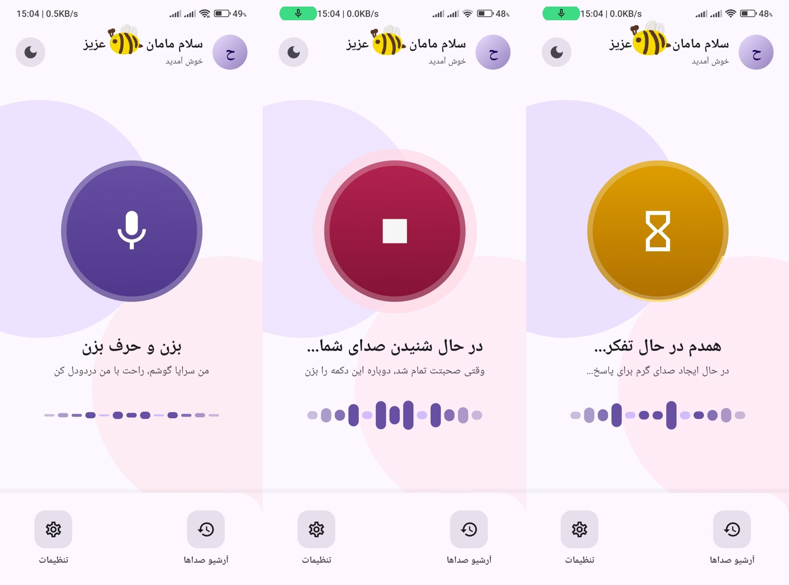
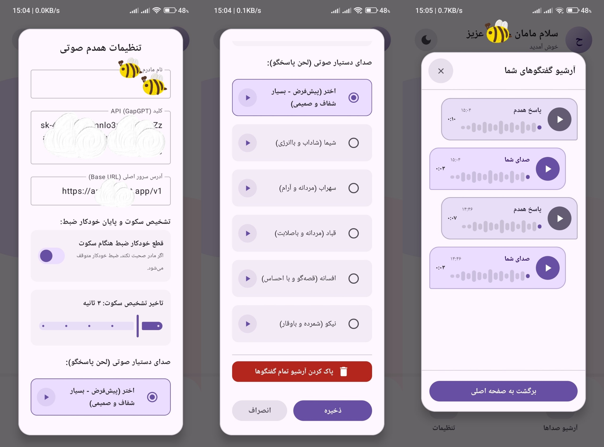

# Hamdam AI Voice APK

Hamdam is a Persian, voice-first Android companion app built for warm, simple conversations with a loved one. It records speech, transcribes it, sends the conversation to an OpenAI-compatible API, generates a short Persian reply, and plays the response back as voice.

The app is designed around a calm RTL interface, large accessible controls, local voice archives, and simple settings for API configuration, voice selection, and automatic silence detection.

<p align="center">
  
</p>

<p align="center">
  
</p>

## Features

- Persian-first RTL experience with a large tap-to-speak control
- Voice recording with microphone permission handling
- Automatic silence detection to stop recording after quiet moments
- Whisper-compatible speech-to-text transcription
- OpenAI-compatible chat completion through the GapGPT endpoint
- Text-to-speech playback with selectable assistant voices
- Local Room database archive for user and assistant voice messages
- Built-in playback controls for archived conversations
- Light and dark theme toggle
- Settings for API key, base URL, mother name, voice, and silence delay

## Tech Stack

- Kotlin
- Jetpack Compose
- Material 3
- Room
- OkHttp
- Kotlin Coroutines and Flow
- Accompanist Permissions
- Gradle Kotlin DSL

## Project Structure

```text
app/src/main/java/com/example/
  audio/                 Audio recording and playback helpers
  data/api/              GapGPT/OpenAI-compatible HTTP service
  data/database/         Room entities, DAO, and database
  data/repository/       Settings and voice chat orchestration
  ui/                    Compose screens, dialogs, and state handling
```

## Requirements

- Android Studio
- JDK 11 or newer
- Android SDK with compile SDK 36 support
- A GapGPT or OpenAI-compatible API key
- A device or emulator with microphone access

## Setup

1. Clone the repository:

   ```bash
   git clone https://github.com/EhsanShahbazii/Hamdam-AI-Voice-APK.git
   cd Hamdam-AI-Voice-APK
   ```

2. Open the project in Android Studio.

3. Let Gradle sync and download the Android dependencies.

4. Run the app on an emulator or physical Android device.

5. Open the in-app settings and enter:

   ```text
   API key: your GapGPT or OpenAI-compatible key
   Base URL: https://api.gapgpt.app/v1
   ```

The default models are configured in `SettingsRepository`:

```text
Whisper: gapgpt/whisper-1
Chat: gpt-4o-mini
TTS: tts-1
Voice: nova
```

## Debug Signing

The debug build type currently points to `debug.keystore` in the project root. If Android Studio reports that the debug keystore is missing, either add a local debug keystore or remove this line from the `debug` build type in `app/build.gradle.kts`:

```kotlin
signingConfig = signingConfigs.getByName("debugConfig")
```

## Privacy Notes

Voice files and conversation history are stored locally on the device through the app database and internal storage. Audio and generated text are sent to the configured API provider only when processing a conversation turn.

Do not commit real API keys, keystores, or local configuration files. The repository already ignores `.env`, `local.properties`, and `debug.keystore`.

## Testing

Run local unit tests from Android Studio, or with a local Gradle installation:

```bash
gradle test
```

## License

This project is licensed under the MIT License - see the [LICENSE](LICENSE) file for details.
